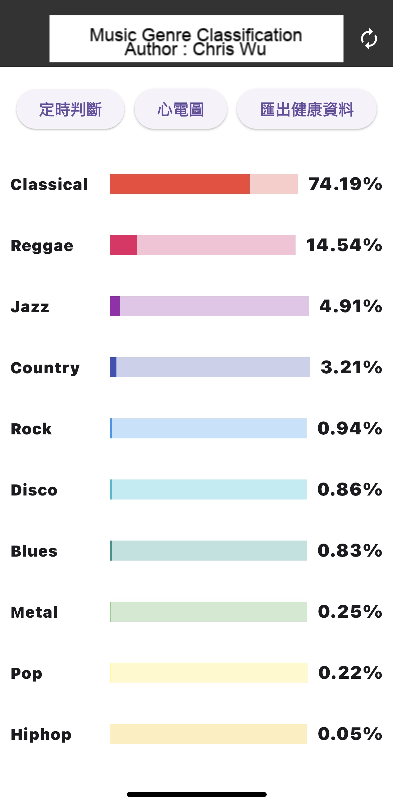

# Music Genre Classification
  
A Flutter application that classifies music genres in real time using audio input and machine learning.  

The model used for classification is a quantized TensorFlow Lite model trained on music genre datasets such as GTZAN. (Details to be added if a custom model is used.)

## Requirements  
- Flutter SDK (latest stable version)  
- Xcode with CocoaPods  
- An active [Apple Developer Program](https://developer.apple.com/programs/) account  
- A valid provisioning profile and certificate configured in Xcode for iOS deployment  

## Setup Instructions  
1. **Register and Configure iOS Developer Account**  
   Ensure you are enrolled in the Apple Developer Program and have your development certificate and provisioning profile set up correctly.  
2. **Open Project in Xcode**  
   Navigate to the `ios/` folder and open the project using Xcode. Verify the signing settings under **Signing & Capabilities**.  
3. **Build and Install the App**  
```bash
cd example/audio_classification
flutter clean
flutter pub get
flutter build ios --release
flutter install
```


# Audio Classification - music_genre_classification

|      | Android | iOS | Linux | Mac | Windows | Web |
|------|---------|-----|-------|-----|---------|-----|
| live |         | ✅   |       |     |         |     |

This project is a sample Flutter app that performs real-time music genre classification using audio input and a pre-trained TensorFlow Lite model (YAMNet). It currently supports iOS and is optimized for on-device inference.

## About

- You can use Flutter-supported IDEs such as Android Studio or Visual Studio.
  This project has been tested on Android Studio Flamingo.
- Before building, ensure that you have downloaded the model and the labels by
  following a set of instructions.


## Screenshots

<p float="left">
  
</p>

