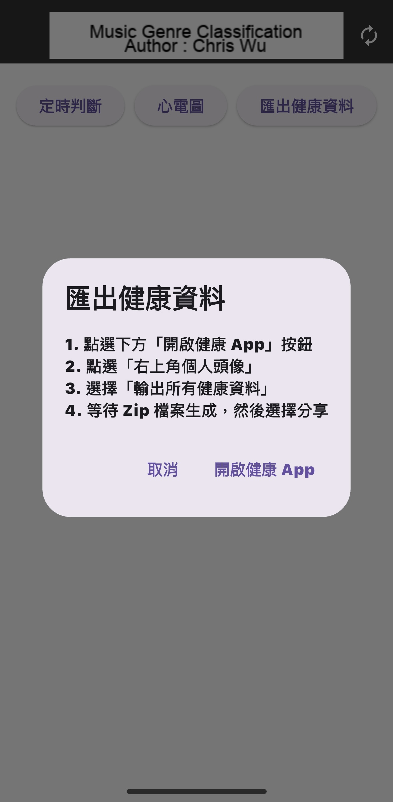

# Audio Classification - music_genre_classification

|      | Android | iOS | Linux | Mac | Windows | Web |
|------|---------|-----|-------|-----|---------|-----|
| live |         | ✅   |       |     |         |     |

This project is a sample Flutter app that performs real-time music genre classification using audio input and a pre-trained TensorFlow Lite model (YAMNet). It currently supports iOS and is optimized for on-device inference.

## About

- You can use Flutter-supported IDEs such as Android Studio or Visual Studio.
  This project has been tested on Android Studio Flamingo.
- Before building, ensure that you have downloaded the model and the labels by
  following a set of instructions.

## Screenshots

